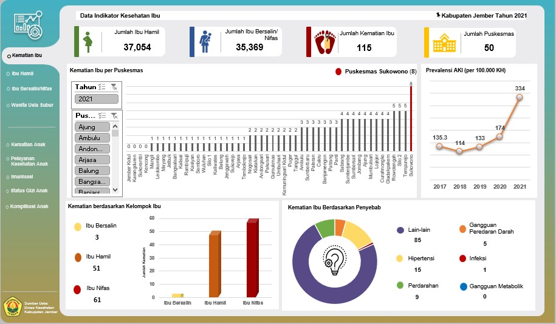

# PERANCANGAN DASHBOARD VISUALISASI DATA KESEHATAN IBU DAN ANAK DI KABUPATEN JEMBER MENGGUNAKAN SPREADSHEET
## (SPREADSHEET VISUALIZATION DASHBOARD OF MATERNAL AND CHILD HEALTH IN JEMBER REGENCY, 2021)

 Faculty of Public Health - University of Jember
 Undergraduate final project by: <a href = "mailto: etaniafebry10@gmail.com">Etania Febry Kirana Putri</a>
 Supervisor: <a href = "mailto: andreiramani@gmail.com">Andrei Ramani</a>
 
 HKI Kompilasi Data, Nomor <a href="https://pdki-indonesia.dgip.go.id/detail/1bc7879748715941e128f021355b72f6eaa3ffdee5dcd37b45157f5c4110a6c3?nomor=EC002023111683&type=copyright&keyword=PERANCANGAN%20DASHBOARD%20VISUALISASI%20DATA%20KESEHATAN%20IBU%20DAN%20ANAK%20DI%20KABUPATEN%20JEMBER%20MENGGUNAKAN%20SPREADSHEET">EC00202352145</a> - Juli 2023
 

